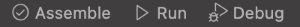

<div align="center">

# Ambiente di sviluppo Assembler per Mac OS

</div>

Questo repository include il necessario per programmare in Assembler su sistemi Mac OS nel corso di **Reti Logiche**, *Ingegneria Informatica, Università di Pisa*. 

**L'ambiente è adatto all'utilizzo sia su sistemi basati su Intel che i nuovi basati su Apple Silicon.**

> ## ⛔️ Disclaimer
>
> Parte del materiale contenuto nel repository è quello **ufficiale** fornito dai docenti. In particolare, l'ambiente GAS per MS-DOS, la libreria [utility.s](./src/files/utility.s) contenente le funzioni per gestire I/O e i files [demo](./src/demo/). 
>
> Per quanto rientra nella mia conoscenza, tutto ciò è di pubblico dominio, pertanto non si configura alcuna violazione di norme sul diritto d'autore. Se così non fosse, si prega di segnalarlo contattandomi privatamente.

# 🔧 Setup

Necessario:

- [Visual Studio Code](https://code.visualstudio.com)
- Estensione [GNU Assembler Language Support](https://marketplace.visualstudio.com/items?itemName=basdp.language-gas-x86)
- Estensione [Tasks](https://marketplace.visualstudio.com/items?itemName=actboy168.tasks)
- Cartella di lavoro ([⬇️ Download *assembler.zip*](https://github.com/giusreds/assembler/releases/latest/assembler.zip))

Scompattare la cartella di lavoro a piacimento nel proprio file system. Supponendo che il nome della stessa sia *assembler*, avviare Visual Studio Code e fare *File > Open folder...*  e selezionare la cartella *assembler*.

La gerarchia della cartella di lavoro apparirà così ([📷 Screenshot](./.github/doc/workspace_folder.png)):

```
assembler				    # Radice cartella di lavoro
├── .vscode				    # Configurazione di VS Code
│   └── tasks.json
├── files
|   ├── dosbox.app          # Eseguibile DOSBox per Mac OS
│   ├── GAS
│   ├── tasks.sh
│   └── utility.s		    # Libreria I/O
└── demo
    ├── demo1.s
    ├── ...                 # Programmi di esempio
    └── demo11.s
```

Contemporaneamente, nella taskbar di Visual Studio Code, appariranno tre pulsanti:



# 🎯 Utilizzo

Creare o aprire un file Assembler (estensione .s) nell'editor.

È consigliabile creare delle sottocartelle a partire dalla radice della cartella di lavoro, all'interno delle quali inserire i files sorgenti Assembler, piuttosto che creare questi ultimi direttamente nella cartella principale.

In ogni caso, per includere la libreria di I/O, il percorso relativo da specificare è sempre a partire dalla radice:

```as
.INCLUDE "./files/utility.s"
```
Ciò è in linea con il comportamento dell'ambiente di sviluppo fornito dai docenti per le piattaforme Windows/Linux.

> ### ⚠️ Nota Bene
>
> Per utilizzare correttamente tutti i tasks sottostanti, è necessario che sia correttamente aperto e attivo un editor con un file Assembler (.s).

## ✅ Assemblaggio

Per assemblare il codice, fare clic su *Assemble* in basso a sinistra nella barra. Si aprirà una finestra di DOSBox per eseguire l'assemblaggio. Se non si verificano errori, verrà chiesto solo di premere un tasto qualsiasi per uscire, altrimenti, verrà anche mostrato l'output dell'assemblatore.

## ▶️ Esecuzione

Per eseguire il codice, dopo averlo correttamente assemblato, fare click su *Run* in basso a sinistra nella barra. Il proprio programma verrà eseguito sotto DOSBox. Al termine dell'esecuzione, verrà chiesto di premere un tasto qualsiasi per terminare l'emulatore.

## 🐞 Debugging

Per debuggare il codice, dopo averlo correttamente assemblato, fare click su *Debug* in basso a sinistra nella barra. Verrà lanciato GDB sotto DOSBox.


# 💪 Extra

Di default, l'ambiente è configurato per non mostrare il terminale di sistema con l'output dello script che esegue i tasks. Per modificare questo comportamento, modificare il file *.vscode/tasks.json* impostando:

```json
"reveal": "always"
```
---

Made with ❤️ by Giuseppe Rossi
